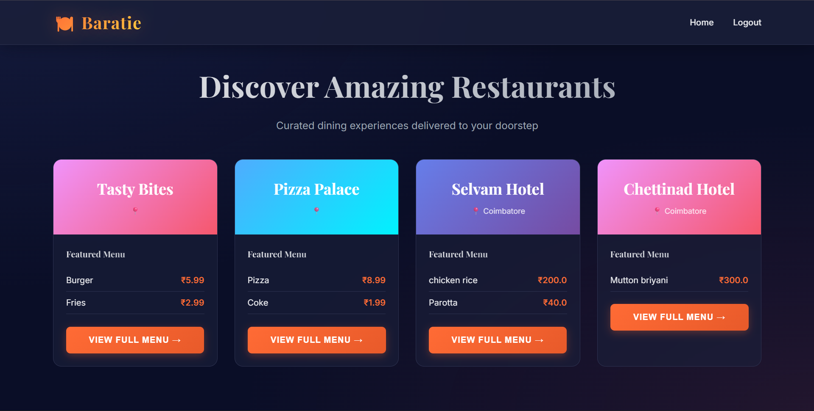
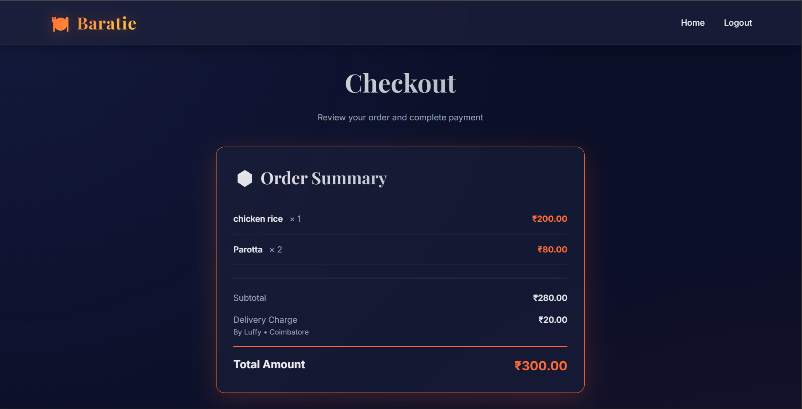
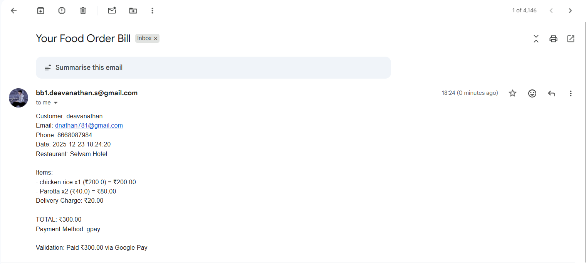

# Baratie - A Scalable Food Ordering System Built on Microservices Architecture

A production-ready, scalable food ordering platform built with Flask microservices architecture, featuring comprehensive user and admin management, real-time order processing, multi-payment gateway integration, and automated email notifications.

## 🌟 Features

### User Features
- **User Registration & Authentication**: Secure registration with email, phone, address, and city information
- **Restaurant Discovery**: Browse restaurants filtered by city with detailed menu listings
- **Shopping Cart**: Add multiple items from different restaurants to cart
- **Order Management**: Place orders with real-time tracking and order history
- **Multiple Payment Options**: Support for GPay, PhonePe, Card, and other payment methods
- **Email Notifications**: Automated bill generation and email delivery with complete order details

### Admin Features
- **Admin Dashboard**: Comprehensive control panel for system management
- **Restaurant Management**: Add and manage restaurants with location-based organization
- **Product Management**: Dynamic product addition with restaurant-specific menus
- **Delivery Personnel Management**: Manage delivery staff with city-wise allocation and charge configuration
- **Real-time Analytics**: Monitor orders, payments, and system performance

## 🏗️ Architecture

This system follows a **microservices architecture** pattern with the following services:

```
┌─────────────┐
│   Frontend  │ (Port 5001)
│   Service   │
└──────┬──────┘
       │
       ▼
┌─────────────┐
│ API Gateway │ (Port 5000)
└──────┬──────┘
       │
       ├──────────────┬──────────────┬──────────────┬──────────────┬──────────────┐
       ▼              ▼              ▼              ▼              ▼              ▼
┌──────────┐   ┌──────────┐   ┌──────────┐   ┌──────────┐   ┌──────────┐   ┌──────────┐
│  Login   │   │  Hotel   │   │  Order   │   │ Payment  │   │  Admin   │   │Notification│
│ Service  │   │ Service  │   │ Service  │   │ Service  │   │ Service  │   │  Service  │
│(Port 5002)│  │(Port 5003)│  │(Port 5004)│  │(Port 5005)│  │(Port 5006)│  │(Port 5007)│
└──────────┘   └──────────┘   └──────────┘   └──────────┘   └──────────┘   └──────────┘
```

### Service Responsibilities

| Service | Port | Responsibility |
|---------|------|----------------|
| **Frontend** | 5001 | Serves HTML/CSS/JS, handles user interface |
| **API Gateway** | 5000 | Central routing, request orchestration, load balancing |
| **Login Service** | 5002 | User/Admin authentication, registration, session management |
| **Hotel Service** | 5003 | Restaurant CRUD operations, menu management, city-based filtering |
| **Order Service** | 5004 | Order lifecycle management, cart operations, order tracking |
| **Payment Service** | 5005 | Payment processing, transaction management, multiple payment methods |
| **Admin Service** | 5006 | Admin operations, restaurant/product/delivery management |
| **Notification Service** | 5007 | Email notifications, bill generation, order confirmations |

### Consolidated Services (Optional)
- **Core Service**: Combines Login, Hotel, and Admin services
- **Transaction Service**: Combines Payment, Order, and Notification services

## 🎨 Design Patterns Implemented

### 1. **Builder Pattern** (Bill Generation)
Used for constructing complex bill objects with multiple optional components:
- Customer details (name, email, phone)
- Order items with quantities and prices
- Delivery charges
- Payment method
- Timestamp and restaurant information

### 2. **Strategy Pattern** (Payment Processing)
Implements different payment strategies for flexible payment method handling:
- GPay Strategy
- PhonePe Strategy
- Card Payment Strategy
- Cash on Delivery Strategy

### 3. **API Gateway Pattern**
Centralized entry point for all client requests, providing:
- Request routing
- Service orchestration
- Load balancing
- Authentication/Authorization

## 🚀 Getting Started

### Prerequisites

- Python 3.8 or higher
- pip (Python package manager)
- Git

### Installation

1. **Clone the repository**
   ```bash
   git clone https://github.com/devanathandna/Baratie-A-Scalable-Food-Ordering-System-Built-on-Microservices-Architecture.git
   cd Baratie-A-Scalable-Food-Ordering-System-Built-on-Microservices-Architecture
   ```

2. **Install dependencies**
   ```bash
   pip install -r requirements.txt
   ```

### Running the System

#### Option 1: Run All Services (Recommended)
```bash
python run_services.py
```

#### Option 2: Run Services Individually
Open separate terminal windows for each service:

```bash
# Terminal 1 - API Gateway
python api_gateway/app.py

# Terminal 2 - Frontend
python frontend/app.py

# Terminal 3 - Login Service
python login_service/app.py

# Terminal 4 - Hotel Service
python hotel_service/app.py

# Terminal 5 - Order Service
python order_service/app.py

# Terminal 6 - Payment Service
python payment_service/app.py

# Terminal 7 - Admin Service
python admin_service/app.py

# Terminal 8 - Notification Service
python notification_service/app.py
```

## 📖 Usage Guide

## 📸 Screenshots

<div align="center">

### Dashboard


### Order Summary


### Email Receipt


</div>

### For Users

1. **Access the Application**
   - Open your browser and navigate to `http://localhost:5001`

2. **Register/Login**
   - New users: Click "Register" and provide:
     - Name
     - Phone Number
     - Email
     - Address
     - City
     - Password
   - Existing users: Login with email and password

3. **Browse Restaurants**
   - View restaurants available in your city
   - Browse menus with food items, quantities, and prices

4. **Place an Order**
   - Add items to cart
   - Review cart and proceed to checkout
   - View bill with itemized costs and delivery charges
   - Select payment method (GPay, PhonePe, Card, etc.)
   - Confirm payment

5. **Receive Confirmation**
   - Email notification with complete bill details
   - Order tracking information

### For Admins

1. **Admin Login**
   - Navigate to `http://localhost:5001/admin`
   - Login with admin credentials

2. **Add Restaurant**
   - Provide restaurant name, address, city
   - Add initial menu items with prices

3. **Add Products**
   - Select restaurant from dropdown
   - Add food items with name, quantity, and price

4. **Manage Delivery Personnel**
   - Add delivery staff with name, phone, city
   - Set delivery charges per city/area

## 🔧 Configuration

### Email Configuration
Update the notification service with your email credentials:
```python
email_address = "your-email@gmail.com"
password = "your-app-password"  # Use App Password for Gmail
```

### Database Configuration
The system uses in-memory data structures. For production, integrate with:
- PostgreSQL/MySQL for relational data
- MongoDB for document storage
- Redis for caching and session management

## 📊 API Endpoints

### User APIs
- `POST /api/register` - User registration
- `POST /api/login` - User authentication
- `GET /api/restaurants` - Get restaurants by city
- `POST /api/cart/add` - Add item to cart
- `POST /api/order/place` - Place order

### Admin APIs
- `POST /api/admin/login` - Admin authentication
- `POST /api/admin/restaurant` - Add restaurant
- `POST /api/admin/product` - Add product
- `POST /api/admin/delivery` - Add delivery personnel

### Payment APIs
- `POST /api/payment/process` - Process payment
- `GET /api/payment/methods` - Get available payment methods

## 🛠️ Technology Stack

- **Backend**: Flask (Python)
- **Frontend**: HTML5, CSS3, JavaScript
- **Architecture**: Microservices
- **Communication**: REST APIs
- **Email**: SMTP (Gmail)
- **Design Patterns**: Builder, Strategy, API Gateway

## 🎯 Future Enhancements

- [ ] Database integration (PostgreSQL/MongoDB)
- [ ] Real-time order tracking with WebSockets
- [ ] Mobile application (React Native/Flutter)
- [ ] Advanced analytics dashboard
- [ ] Rating and review system
- [ ] Loyalty points and rewards
- [ ] Multi-language support
- [ ] Docker containerization
- [ ] Kubernetes orchestration
- [ ] CI/CD pipeline integration

## 🤝 Contributing

Contributions are welcome! Please feel free to submit a Pull Request.

## 📝 License

This project is open source and available under the [MIT License](LICENSE).

## 👨‍💻 Author

**Devanathan**
- GitHub: [@devanathandna](https://github.com/devanathandna)

## 🙏 Acknowledgments

- Inspired by real-world food delivery platforms
- Built as a demonstration of microservices architecture
- Named after the famous restaurant "Baratie" from One Piece

---

**Note**: This is a demonstration project. For production use, implement proper security measures, database persistence, and error handling.
